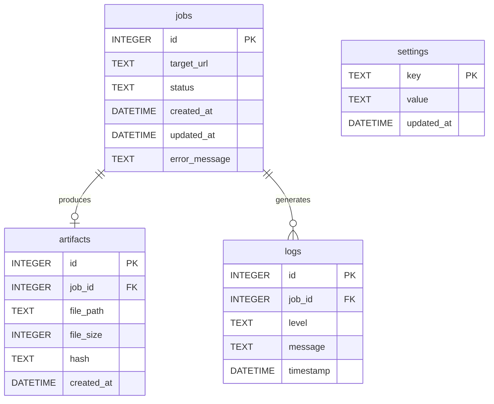

# Database — SQLite (AI Landing Page Uniqueizer)

Canonical DDL and invariants: **`Claude_v1.1_fixed.txt` §3.2 and §4 (M*)**.  
Apply in code as `backend/migrations/001_init.sql` (path per PRD).

## ER diagram (Mermaid)

- **`settings`** has **no foreign key** to `jobs` (global key/value).
- **`jobs ||--o| artifacts`**: zero or one artifact row per job in normal operation; **no `UNIQUE(job_id)`** in SQL — enforce “at most one ZIP per job” in application logic (see PRD EC-17).

## Coordination model

- SQLite is a **shared file** used for queueing and state — **not** OS-level IPC.
- **WAL** mode: API reads and worker writes can overlap with fewer lock issues than DELETE journal mode.
- **Worker boundary (MVP):** `asyncio.Task` started in FastAPI `lifespan`, **same OS process** as the HTTP server; poll interval `WORKER_POLL_INTERVAL` (default 2s).
- **Claim:** use atomic `UPDATE … WHERE id=? AND status='pending'` and verify `rowcount == 1` (PRD EC-15).

## `jobs.status` lifecycle

`pending` → `running` → `done` **or** `failed` (terminal).  
Fine-grained pipeline progress is in **`logs`**, not extra values in `jobs.status`.

## HTML mirror

Interactive layout: [`html/database-2.html`](./html/database-2.html)  
Mermaid-only ERD: [`html/database-1.html`](./html/database-1.html)
